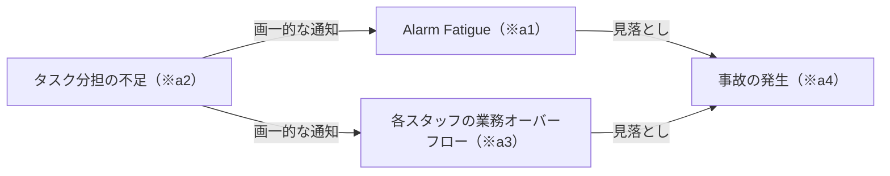
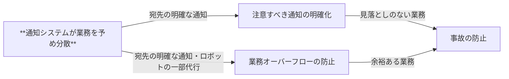
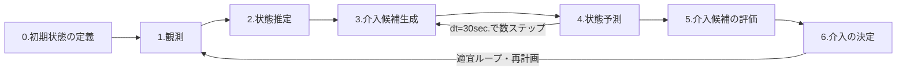

# 研究全体像・新研究の整理

## 学士～博士の研究全体像
### 大テーマ
病棟における「スタッフの負荷低減」と「患者の事故リスク低減」を両立する見守りの実現

### 個別研究テーマ
#### テーマ一覧
- 学士：すれ違い時歩行計測のための移動ロボットの動作計画
- 修士：病棟共有空間における、患者リスク評価
- 博士：病棟全体における、患者の事故リスクとスタッフの負荷の低減を両立する、ロボットによる見守り計画・通知計画

#### 位置付け・差別化の整理
|  | 学士 | 修士 | 博士 |
| --- | --- | --- | --- |
| 時間 | 数秒 | 数秒～数分 | 数分～数時間 |
| 空間 | 患者1人 | 患者数人（同一室内） | フロア全体(スタッフ含む) |
| 解像度 | 高(表情・関節角度) | 中(行動ラベル) | 低(位置情報) |
| ↓ | ↓ | ↓ | ↓ |
| 分かること|バイタル|患者単位のリスク|スタッフの負荷|

#### 個別研究テーマと大テーマの結びつき
- 【期間】：【事故リスク低減のアプローチ】➡【スタッフの負荷低減のアプローチ】
- 学士：ロボットによる能動的見守り➡見守りの代行
- 修士：現場知識から抽出したリスク評価体系➡通知過多の解消
- 博士：スタッフの業務負荷を見越したロボットの見守り計画や通知方法の計画➡スタッフの業務負荷超過の防止

## 博士向け研究 (D研) の検討内容
### 着目する現場課題 (As-Is, To-Be分析)
#### As-Is, To-Be分析【具体】
##### 登場人物
- Aさん：認知症の80歳女性。車椅子
- Bさん：徘徊してしまう80歳男性。杖歩行
- Cさん：自立許可のある65歳男性。歩行器
- Dさん：若手女性介護福祉師。ピンク色の白衣
- Eさん：熟練女性看護師。紺色の白衣
- Fさん：男性医師。白い白衣
- Gロボ：ロボット。移動・会話・映像のナースステーション伝送が可能
##### シナリオ
| # | As-Is | To-Be |
| --- | --- | --- |
| 1 | 夜、デイルームでテレビを見ているAさんを、その背後にあるナースステーションでDさんが見守っている | 同左 |
| 2 | 突如Bさんのナースコール（離床）が点滅・鳴って、誰も応じない(※a1)ことをDさんが気にする | ロボットがDさんに「ロボットが確認に行っています。念のためモニタを確認しておいてください」と言い、Bさんのもとへロボットが向かう。(※t1) |
| 3 | Dさんが「私が行かなきゃかも！(※a2)Aさんのことが気になるけど...(※a3)」と、Aさんを振り返りながらもBさんの元へ廊下を走る | パターンA: ロボットがBさんを映しながら「誤報でした」とDさんに報告する パターンB: ロボットがBさんを映しながら「転倒しています。Dさんは見守り中ですよね。E看護師・F医師来れますか？」とDさんに情報共有しつつ、E,Fさんを呼ぶ(※t2)。 パターンC: ロボットがBさんを映しながら「トイレに行きたかったそうです。付き添っておきますね(※t3)」とDさんに報告する |
| 4 | Bさんのナースコールは誤報だった...とほっとして帰ってきたら、Aさんが車椅子から落ちていて(※a4)Dさんが青ざめる | Dさんは安心してAさんの見守りを続けられる |

##### シナリオのポイント
- (※a1): 慢性的なアラーム過多による疲れ・慣れ (Alarm Fatigue)
- (※a2): 業務分担の不足
- (※a3): 業務のオーバーフロー
- (※a4): 事故の発生
- (※t1): 一部業務のロボットによる代行
- (※t2): しすてむによる業務分担(スタッフへの協力要請)
- (※t3): しすてむによる業務分担(ロボットが代替できることは引き受ける)

#### As-Is, To-Be分析【抽象】
- As-Isで実現できておらず、To-Be像で実現できていること
  - **スタッフの業務オーバーフローを防ぐ**、通知・ロボット動作が計画・実行されている
    - ➡Alarm Fatigueの解消
    - ➡**事故の防止**

- As-Is

- To-Be

### 関連研究
- 病棟見守り・異常検知
  - 例 
    - hoge
    - hoge
  - 検知性能の向上が主眼で、通知がスタッフの業務にもたらす影響までは考慮されていない
- 業務負荷の予測
  - 例
    - 入退院データやカルテから、データドリブンで繁忙期を予測
  - 因果に基づく予測は少なく、通知やロボットなど、システムの挙動がもたらす業務負荷の変化を予測する研究は少ない

### 研究課題
- 病棟スタッフの業務負荷分散を考慮した、移動ロボットによる見守り支援・通知計画の実現

### システムに求められること
- 病棟の状況から、システムが実行可能な行動を起こした先の未来（数分～数時間）の病棟の状況を予測できる（行動に応じて枝分かれしていくイメージ）
- 予測結果から、事故リスクが低減でき、、かつスタッフの業務負荷も平準化できる、通知の仕方ややロボットの行動を計画できる

### 着眼点
- 事故リスクの低減と業務オーバーフローの防止の両立には、「スタッフの業務の分担」が重要ではないか（下記。↔As-Is）

- 業務負荷を考える観点では、スタッフの属性・位置・タスクに依存➡因果モデルに加え、時空間モデルを用いた考慮が必要ではないか
- ロボットの介入や通知に伴う業務負荷の変化を考える必要性➡現場知識を因果モデルに落とし、what-if分析が可能な体系での考慮が必要ではないか

### 解決のアプローチ

- 処理のイメージ
- 0.初期状態の定義：施設構造・登場人物を定義する。[画像](images/step0.png)参照
- 1.観測：各登場人物の位置情報を取得する。[画像](images/step1.png)参照
- 2.状態推定：各登場人物のタスクを施設構造などをもとに推定する。[画像](images/step2.png)参照
- 3.介入候補生成：システムが出来る介入候補（通知の発出・ロボットへの指令など）を生成する。[画像](images/step3.png)参照
- 4.状態予測：3.で生成された介入候補を実行した先の未来の病棟の状況をそれぞれ予測する。[画像](images/step4_pattern1.png)または[画像](images/step4_pattern2.png)参照
- 5.介入候補の評価：予測結果から、事故リスクの低減と業務オーバーフローの防止の両立の観点で、介入候補を評価（アルゴリズム検討中）
- 6.介入の決定：評価結果から、実行する介入を決定

### 要検討ポイント
- 4.状態予測の実装方法
  - ロボットが介入したり、通知を送信したりした先の病棟全体の動きを予測する必要がある。ルールベース・POMDPなどが考えられるが、現実との乖離が大きい可能性がある。Physical AIがもう少し進展すれば、世界モデルを用いた予測が出来るかもしれない。したがって、自身の研究のメインとしたくはないが、現時点では手法が定まっていない。
- 5.介入候補の評価方法
  - 事故リスクと業務負荷の分散具合をそれぞれ評価関数に落とせば評価可能であるが、評価関数の設計が難しい。現場知識を知識グラフに落として、ロジカルに評価することができないか検討したいが、現時点では手法が定まっていない。