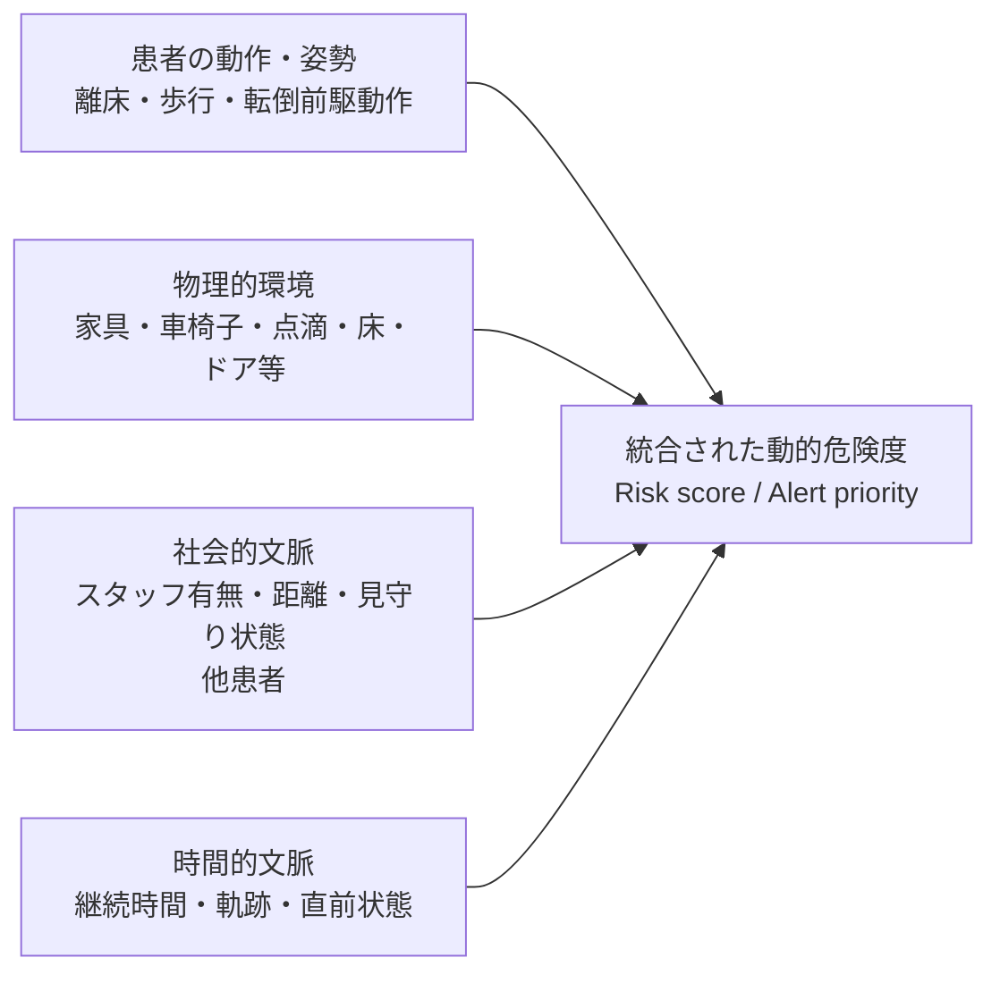

# 病棟共有空間における「周囲物・スタッフの見守り状況」を含む患者危険性評価システムの調査

## エグゼクティブサマリ

結論を先に述べると、**「病棟のデイルーム・食堂などの共有空間」で、「患者の動作」に加え、「周囲の物・環境」と「スタッフの有無／見守り状態」を同時に認識し、それらを明示的に転倒等の危険性評価へ入力する、査読済みの実環境研究は、今回の検索では確認できませんでした。** 一方、それを構成する技術要素を部分的に満たす研究は存在します。

特に近いのは Gabriel et al. (2025) です。実病院11施設・387患者・1,466 patient-days規模で、カメラ画像から**患者・スタッフ・その他の人物、ベッド・椅子、患者の動き**を認識し、さらに「患者が一人」「スタッフに見守られている」という論理状態を時系列化しています。これは今回の問題設定に非常に近いものの、対象は**病室**であり、これらを統合した単一の「転倒危険度スコア」を算出する研究ではありません。 citeturn24view1turn24view2turn24view3

環境要因を危険度そのものに明示的に組み込む研究としては、Sabbagh Novin et al. (2021) が、**照明、床、支持物、浴室ドア、患者移動軌跡**を統合した計算論的転倒リスクモデルを提示しています。Chaeibakhsh et al. (2021) はこれを室内レイアウト最適化へ拡張しました。しかし、いずれもスタッフの存在を扱わず、共有空間でのリアルタイム見守りでもありません。 citeturn22view1turn23search4turn23search2

スタッフの存在を機械的に認識する実病院研究では Danial et al. (2025) が近く、AIが患者動作だけでなくスタッフを認識し、スタッフがいる場合のアラート処理に利用しています。ただし、**スタッフ存在は危険度を算出する入力ではなく、主にアラート抑制・応答記録のための文脈情報**です。 citeturn24view0

さらに特許では、CareView の US9041810B2 が非常に興味深く、ベッド、椅子、車椅子、シャワー、出入口等に対応する「高危険領域」と患者の動きを組み合わせ、さらに RFID/FOB で医療スタッフの存在を検知してアラートを解除・再開する構成を記載しています。概念上は今回の要求にかなり近い一方、**病室中心であり、臨床性能を検証した論文ではありません**。 citeturn16view5turn17view0

したがって判定は二段階になります。

> **厳密な条件では：「ほとんどない」**  
> **病室研究・環境モデル・特許まで隣接研究を含めれば：「存在するが限定的」**

2026年の最新スコーピングレビューでも、継続モニタリング型の入院患者転倒予防研究は、主として**病室内監視、ベッド離床、ベッド／椅子離脱、看護師へのアラート**に集中しています。38件のaction-trigger型研究と20件の予測・検出研究が整理されていますが、「共有空間で人・物・スタッフの社会的／環境的文脈を統合した危険性推定」は主要カテゴリとして現れていません。これは、今回見いだしたギャップと整合します。 citeturn19search0turn19search3

## 検索方針と該当性判定

公開アクセス可能な査読論文・国際会議論文・出版社ページ・2026年までを対象とするスコーピングレビュー・Google Patentsを横断し、日本語では「病棟／デイルーム／食堂／共用部／見守り／転倒／スタッフ」、英語では `"patient monitoring"`, `"ward common area"`, `"day room"`, `"dining room"`, `"fall risk"`, `"context-aware"`, `"environmental factors"`, `"staff presence"`, `"supervision"`, `"multimodal"`, `"fall detection"` 等を組み合わせて探索しました。

特に、単なる「カメラで患者を検出する研究」を該当研究とはせず、以下を分離して判定しました。

| 文献・技術 | 共有空間 | 患者動作 | 周囲物・環境 | スタッフ存在／見守り | 危険性評価へ明示的統合 | 実病院 |
|---|---:|---:|---:|---:|---:|---:|
| Gabriel 2025 | × 病室 | ○ | ○ ベッド・椅子 | **○** | △ 状態・トレンドで統合 | **○** |
| Danial 2025 | × 病室/急性期病床 | **○** | × | **○** | △ 主にアラート抑制 | **○** |
| Gervasi 2025 | × 病室 | **○** | △ 空間・トイレ等 | × | △ 行動イベント中心 | **○** |
| Coahran 2018 | ×/未指定 | **○** | × | × | × | **○** |
| Sabbagh Novin 2021 | × 病室 | ○ 模擬軌跡 | **○** | × | **○** | × 計算モデル |
| Chaeibakhsh 2021 | × 病室 | ○ 模擬軌跡 | **○** | × | **○** | × シミュレーション |
| CareView特許 | × 病室 | **○** | **○** | **○ RFID等** | **○/△** アラーム判断 | 実証未指定 |
| Hill-Rom特許 | ×/施設全般 | ○ | **○ 複数機器** | △ | **○ falls risk score** | 実証未指定 |

ここで重要なのは、**「スタッフへ通知する」ことと、「スタッフが患者のそばにいることを危険性計算の入力にする」ことは別**だという点です。既存研究の多くは前者であり、後者まで扱うものはかなり少数です。Gabriel et al. と CareView 特許が、この区別において特に近い先行例です。 citeturn24view2turn16view5

## 主要文献の概要

以下では、ユーザー指定の属性に沿って各文献を整理します。「未指定」は公開本文・抄録から確認できなかった項目です。

- **Gabriel et al., 2025 — Continuous patient monitoring with AI: real-time analysis of video in hospital care settings**
  - **短い要約:** 今回見つかった査読論文の中で、技術的には最も近い研究です。病室映像から患者だけでなく、**スタッフ・その他の人物、ベッド、椅子、動き**を検出し、「患者が一人」「スタッフによる見守りあり」を論理推論しています。 citeturn24view2
  - **対象環境:** 11病院の病室。**デイルーム・食堂ではない**点が最大の相違です。 citeturn24view1
  - **主要手法:** 1 fpsの映像、YOLOv4系物体検出、人物役割分類（patient/staff/other）、dense optical flow。検出・動作情報から5秒平滑化を施し、`person alone`、`patient supervised by staff` 等をルールベースで生成します。 citeturn24view2turn24view3
  - **周囲要素:** person、bed、chairを明示的に認識。スタッフも独立した人物属性として認識します。 citeturn24view2
  - **時間的文脈:** 一人／見守り状態を秒単位で推定し、1時間・24時間単位のトレンドとして集約します。 citeturn24view2
  - **データセット:** 40,000枚超を注釈し、10,000枚をテスト用に保持。公開データ部分は**387患者、1,466 patient-days、11病院**。転倒を経験した10患者について54 patient-daysの詳細観察ログも作成しています。 citeturn24view1turn24view3
  - **プライバシー:** 解析例はぼかし処理され、匿名化されたデータが研究用に用いられています。 citeturn24view2
  - **評価指標:** precision、recall、F1、時間トレンド精度等。最新版モデルでは物体検出のmacro F1がおおむね0.92、患者役割分類F1が0.98、「patient alone」等の論理推定も高い性能を示し、患者一人状態の時間トレンド精度は全体で約0.82と報告されています。 citeturn4view2turn4view3
  - **今回の要求との差:** **「物＋スタッフ＋動作」は満たすが、共有空間ではなく、それらを単一の転倒リスクスコアへ融合してはいない。**
  - **URL:** [Frontiers / DOI](https://doi.org/10.3389/fimag.2025.1547166)

- **Danial et al., 2025 — AI-based patient monitoring for fall prevention in stroke patients**
  - **短い要約:** マレーシアの実際の急性期脳卒中病棟で、AI Patient Sitterを前向き運用した研究。スタッフを画像から識別する点が重要です。 citeturn24view0
  - **対象環境・対象者:** Hospital Seberang Jaya の6床のAcute Stroke Unit、脳卒中患者30名。平均年齢61±12.8歳、83.3%が高転倒リスクでした。 citeturn24view0
  - **主要手法:** 光学センサー＋AI画像認識による姿勢・移動・離床監視。ResNet系CNN等を利用し、スタッフは制服等を利用して識別します。スタッフ存在時には、不要アラートの解除等のワークフローに利用されます。 citeturn24view0turn9view1
  - **周囲要素:** 周辺家具等を転倒危険度の入力として認識する機能は未指定。
  - **スタッフ文脈:** **あり。ただし「スタッフがいるから転倒リスクをx%低下」といったリスク融合ではなく、主としてアラート処理・応答記録に利用。**
  - **時間的文脈:** 離床時刻、最初の離床までの時間、スタッフ応答時間をイベントログとして記録。 citeturn24view0
  - **プライバシー:** blurred/non-identifiable imageを用いています。 citeturn24view0
  - **評価:** 1,439アラート、accuracy 95.34%、median response time 21秒、転倒1件。論文では過去年との比較から83.33%低下としていますが、**無作為対照試験ではなく歴史的比較であるため、因果効果としての解釈には注意が必要**です。 citeturn24view0turn8view0
  - **今回の要求との差:** 共有空間ではなく、物体・環境要素が危険性評価に入っていません。
  - **URL:** [Springer Nature / DOI](https://doi.org/10.1186/s12984-025-01706-9)

- **Gervasi et al., 2025 — Verso Vision**
  - **短い要約:** イタリアの実病院でコンピュータビジョンによる24時間転倒予防システムを評価した、比較的大規模な実装研究です。 citeturn17view1
  - **対象環境:** Medicine/Oncology wards の**10病室・20床**。共有空間ではありません。 citeturn18view0
  - **対象者・データ:** 362入院患者、平均年齢75.3歳。観察期間を監視有無とStratify scoreの変化で分け、580統計単位として解析しています。 citeturn17view1turn17view2
  - **主要手法:** カメラ＋AI computer vision。bed-exit attempt、bed exit、room exit、fallのほか、**トイレ滞在時間が看護師設定値を超えた場合**も通知します。これは単一フレームの動作検知より一歩進んだ「場所×時間」の文脈利用です。 citeturn18view0
  - **スタッフ文脈:** スタッフへスマートフォン通知を行いますが、**スタッフが既にその場にいるか否かを危険度計算へ入力するとの記載は確認できません**。 citeturn18view0
  - **評価指標:** 転倒発生率およびincidence rate ratio。監視あり5件、なし15件の転倒が記録され、多変量Poisson回帰ではVS利用のIRR 0.21（95% CI 0.12–0.38）、propensity-score weightingによる感度分析では0.22でした。ただし研究は後ろ向き・非無作為化です。 citeturn17view3turn18view0
  - **今回の要求との差:** 実証規模は強いものの、周囲物・スタッフの存在をexplicitな危険性計算へ融合していません。
  - **URL:** [Frontiers / DOI](https://doi.org/10.3389/fdgth.2025.1548209)

- **Coahran et al., 2018 — HELPER**
  - **短い要約:** 高齢者精神科病院で天井設置型の自動転倒検出システムを実環境評価し、看護師へのインタビューも実施した研究です。 citeturn22view3
  - **主要手法:** 天井設置センサーによる転倒検出→スマートフォン通知。
  - **対象環境:** geriatric mental health hospital。公開抄録からデイルームへの設置は確認できず、共有空間研究とは扱えません。 citeturn22view3turn23view0
  - **データセット・規模:** 公開抄録から詳細人数は未指定。
  - **評価指標・結果:** sensitivity **0.80**、positive predictive value **0.01**。病院記録上の転倒1件を見逃した一方、記録されていなかった転倒4件を検出しました。大量のfalse alarmsがPPVを低下させています。 citeturn22view3
  - **スタッフ文脈:** 看護師の認識・ワークフローを質的に評価していますが、スタッフ存在をAI危険度の入力にはしていません。
  - **今回の要求との差:** 「見守る側」まで評価した点は有用ですが、社会的文脈を機械推論には統合していません。
  - **URL:** [Cambridge / DOI](https://doi.org/10.1017/S0714980818000181)

- **Sabbagh Novin et al., 2021 — Computational fall-risk model**
  - **短い要約:** 「患者側の内因性リスクだけではなく、**周囲環境そのものを危険性評価へ明示的に入れる**」という点で極めて重要な先行研究です。 citeturn22view1
  - **主要手法:** 文献から環境要因と転倒危険性の関係をモデル化し、trajectory optimizationで患者の移動を予測。 citeturn22view1
  - **環境要因:** **照明、床材、支持物、浴室ドア**という静的要因と、患者の移動という動的要因を同一モデルに含めます。 citeturn22view1
  - **データセット:** 実患者センシングデータではなく、典型的な4種類の患者室レイアウトをモデル評価。
  - **評価指標:** モデルで算出するレイアウトごとのfall risk。AUC、precision、recall等は未指定。
  - **結果:** レイアウト・設備差によって異なる転倒危険性をモデルが表現できることを示していますが、著者自身が**actual patient fall dataとの比較検証が必要**としています。 citeturn22view1
  - **スタッフ文脈:** なし。
  - **今回の要求との差:** 環境文脈は非常に強いが、「リアルタイム見守り」「スタッフ存在」「共有空間」を満たしません。
  - **URL:** [SAGE / DOI](https://doi.org/10.1177/1937586720959766)

- **Chaeibakhsh et al., 2021 — Optimizing Hospital Room Layout**
  - **短い要約:** Sabbagh Novinらの環境型fall-risk modelを使い、患者周囲の物の支持的／危険な効果と患者の模擬移動軌跡を考慮して、部屋レイアウトを自動最適化した国際会議論文です。 citeturn23search4turn23search2
  - **主要手法:** gradient-free constrained optimization、simulated annealing。目的関数自体が「周囲物＋患者軌跡」に基づくfall riskです。 citeturn23search4
  - **データセット:** 2種類の実在する病室タイプを基にしたシミュレーション。実患者の連続センシングデータではありません。 citeturn23search4
  - **評価指標・結果:** 最適化前後のモデル上のfall risk。従来型レイアウト比で平均**18%改善**、ランダム生成レイアウト比で**41%改善**。 citeturn23search4
  - **スタッフ文脈:** なし。
  - **今回の要求との差:** 「物×移動→危険度」は明確ですが、スタッフ・共有空間・リアルタイム認識がありません。
  - **URL:** [SCITEPRESS](https://www.scitepress.org/Papers/2021/102263/)

- **Kubota et al., 2026 — 最新スコーピングレビュー**
  - **短い要約:** 個別システムではなく、今回の「研究ギャップが本当にあるのか」を確認するうえで重要なエビデンスマップです。 citeturn19search0turn19search3
  - **検索規模:** PubMed、Scopus、Web of Scienceを2026年2月15日に検索。200 recordsから、action-triggerを持つTier 1を38研究、prediction/detection中心のTier 2を20研究として整理しています。 citeturn19search3
  - **主要な研究群:** room-based monitoring＋direct nurse alert、wearable/batteryless bed egress・bed/chair exit、bed-centered early warning。 citeturn19search3
  - **重要な示唆:** 実装研究でもfalse alarm、alert burden、staff response time、alert routing等の報告が不十分とされています。 citeturn19search3
  - **今回の調査への意味:** この分類に「day room/dining roomでのobject＋staff/social-context risk fusion」が独立した主要研究群として現れていないことから、**共有空間の文脈統合型危険推定はまだ研究の空白に近い**と推定できます。ただし、これはレビューの分類に基づく推論であり、「世界中に一件もない」という意味ではありません。 citeturn19search3
  - **URL:** [MDPI / DOI](https://doi.org/10.3390/app16073383)

## 特許で確認できる最も近い構成

査読論文では各要素が分断されていますが、**特許では今回のアイデアにかなり近い構成が既に記述されています**。

- **Ecker, Johnson & Johnson / CareView Communications — US9041810B2, “System and method for predicting patient falls”**
  - **位置づけ:** 今回の検索で、「患者動作＋周囲の危険領域＋医療スタッフ存在」を一つのアラームロジック内で扱うものとして最も近い先行技術です。
  - **主要手法:** カメラ画像中に、ベッドや椅子等の周辺に「virtual bedrail／risk area」を設定し、患者が複数のmotion detection zonesをどの方向に横切ったかという時系列パターンから、転倒前駆動作を判定します。ベッド、椅子、車椅子、シャワー、出入口のthreshold等が高リスク領域の例として示されています。 citeturn16view5
  - **スタッフ存在:** RFID/FOB等で医療スタッフが近くにいることを受動検知し、その間はfall prediction systemを一時的にdisarm、退出後にrearmする構成が明記されています。 citeturn16view5
  - **重要な点:** これは「患者が同じ動作をしても、スタッフがいる場合にはアラームを出さない」という意味で、**supervision contextが意思決定に明示的に影響する**例です。
  - **限界:** 数値的なrisk scoreではなく、アラームON/OFFに近い構造です。また病室中心であり、デイルーム等で複数患者・複数スタッフを扱うものではなく、臨床評価指標も未指定です。
  - **公開情報:** CareView Communicationsがassignee、2015年5月26日発行。 citeturn17view0
  - **URL:** [Google Patents](https://patents.google.com/patent/US9041810B2/en)

- **Kayser et al. / Hill-Rom — US11908581B2, “Patient risk assessment based on data from multiple sources in a healthcare facility”**
  - **位置づけ:** 「複数の周囲機器・情報源を**falls risk scoreそのものへ統合する**」という意味で重要です。
  - **主要手法:** analytics engineがpatient support apparatus、nurse-call computer、physiological monitor、patient lift、locating system、incontinence detection pad等からデータを取得し、**falls risk score**等を算出します。chair monitorとtoilet monitorによる患者動作データの利用も記載されています。 citeturn15view2
  - **時間的文脈:** リスクスコアの変化に応じ、caregiver rounding intervalを動的・自動的に変更する構成があります。 citeturn16view3
  - **スタッフ文脈:** nurse callやlocating system、roundingを扱うものの、公開記載からは**「スタッフが患者の周囲に現在いる」という情報をfalls risk scoreの入力変数として使うことまでは確認できません**。したがって、この項目は△です。
  - **評価:** 臨床データセット、AUC、precision/recall等の検証結果は未指定。
  - **公開情報:** Hill-Rom Services, Inc.がassignee、US11908581B2は2024年2月20日発行。 citeturn22view0
  - **URL:** [Google Patents](https://patents.google.com/patent/US11908581B2/en)

この二つの特許を組み合わせると、研究上の未充足部分がかなり明確になります。CareView は**「患者動作×物の位置×スタッフ存在」**を扱いますがスコア化が弱く、Hill-Rom は**「複数文脈×falls risk score」**を扱いますが、その場のスタッフ存在との融合が明示的ではありません。さらに両者とも、デイルームのような**複数患者・複数スタッフ・複数家具が同時に存在する共有空間**を実環境評価したものではありません。 citeturn16view5turn15view2

## BibTeXファイル

作成済みの `.bib` ファイルはこちらです。

**[ward_common_area_context_aware_patient_monitoring.bib をダウンロード](sandbox:/mnt/data/ward_common_area_context_aware_patient_monitoring.bib)**

内容は以下の通りです。書誌情報は出版社・会議出版社・特許情報に基づいています。 citeturn24view0turn17view4turn22view3turn22view1turn23search2turn22view0turn17view0

```bibtex
@article{Gabriel2025ContinuousPatientMonitoring,
  author  = {Gabriel, Paolo and Rehani, Peter and Troy, Tyler and Wyatt, Tiffany and Choma, Michael and Singh, Narinder},
  title   = {Continuous patient monitoring with AI: real-time analysis of video in hospital care settings},
  journal = {Frontiers in Imaging},
  year    = {2025},
  volume  = {4},
  doi     = {10.3389/fimag.2025.1547166},
  url     = {https://doi.org/10.3389/fimag.2025.1547166}
}

@article{Danial2025AIPatientMonitoring,
  author  = {Danial, Monica and Chow, Chee Toong and Lim, Meng Hui and Ayop, Noor Azleen and Looi, Irene and Ch'ng, Alan Swee Hock},
  title   = {AI-based patient monitoring for fall prevention in stroke patients: a pilot study at a Malaysian acute stroke unit},
  journal = {Journal of NeuroEngineering and Rehabilitation},
  year    = {2025},
  volume  = {22},
  number  = {216},
  doi     = {10.1186/s12984-025-01706-9},
  url     = {https://doi.org/10.1186/s12984-025-01706-9}
}

@article{Gervasi2025VersoVision,
  author  = {Gervasi, Corrado and Perego, Erik and Galli, Francesca and Torri, Valter and Castoldi, Massimo and Bombardieri, Emilio},
  title   = {Prevention of falls in hospitalized patients---evaluation of the effectiveness of a monitoring system (Verso Vision) developed with artificial intelligence},
  journal = {Frontiers in Digital Health},
  year    = {2025},
  volume  = {7},
  pages   = {1548209},
  doi     = {10.3389/fdgth.2025.1548209},
  url     = {https://doi.org/10.3389/fdgth.2025.1548209}
}

@article{Coahran2018HELPER,
  author  = {Coahran, Marge and Hillier, Loretta M. and Van Bussel, Lisa and Black, Edward and Churchyard, Rebekah and Gutmanis, Iris and Ioannou, Yani and Michael, Kathleen and Ross, Tom and Mihailidis, Alex},
  title   = {Automated Fall Detection Technology in Inpatient Geriatric Psychiatry: Nurses' Perceptions and Lessons Learned},
  journal = {Canadian Journal on Aging / La Revue canadienne du vieillissement},
  year    = {2018},
  volume  = {37},
  number  = {3},
  pages   = {245--260},
  doi     = {10.1017/S0714980818000181},
  url     = {https://doi.org/10.1017/S0714980818000181}
}

@article{SabbaghNovin2021ComputationalFallRisk,
  author  = {Sabbagh Novin, Roya and Taylor, Ellen and Hermans, Tucker and Merryweather, Andrew},
  title   = {Development of a Novel Computational Model for Evaluating Fall Risk in Patient Room Design},
  journal = {HERD: Health Environments Research \& Design Journal},
  year    = {2021},
  volume  = {14},
  number  = {2},
  pages   = {350--367},
  doi     = {10.1177/1937586720959766},
  url     = {https://doi.org/10.1177/1937586720959766}
}

@inproceedings{Chaeibakhsh2021OptimizingHospitalRoom,
  author    = {Chaeibakhsh, Sarvenaz and Sabbagh Novin, Roya and Hermans, Tucker and Merryweather, Andrew and Kuntz, Alan},
  title     = {Optimizing Hospital Room Layout to Reduce the Risk of Patient Falls},
  booktitle = {Proceedings of the 10th International Conference on Operations Research and Enterprise Systems (ICORES 2021)},
  year      = {2021},
  pages     = {36--48},
  doi       = {10.5220/0010226300360048},
  url       = {https://www.scitepress.org/Papers/2021/102263/}
}

@article{Kubota2026AIDrivenInpatientFalls,
  author  = {Kubota, Kazumi and Tsuda, Satoko and Kubota, Anna},
  title   = {AI-Driven Inpatient Fall Prevention Using Continuous Monitoring: From Early Detection to Workflow-Integrated Decision Support: A Scoping Review},
  journal = {Applied Sciences},
  year    = {2026},
  volume  = {16},
  number  = {7},
  pages   = {3383},
  doi     = {10.3390/app16073383},
  url     = {https://doi.org/10.3390/app16073383}
}

@misc{Ecker2015PredictingPatientFallsPatent,
  author       = {Ecker, Stephen and Johnson, Kyle Brook and Johnson, Steven Gail},
  title        = {System and method for predicting patient falls},
  year         = {2015},
  howpublished = {U.S. Patent US9041810B2},
  note         = {Assignee: CareView Communications Inc.; published 2015-05-26},
  url          = {https://patents.google.com/patent/US9041810B2/en}
}

@misc{Kayser2024PatientRiskAssessmentPatent,
  author       = {Kayser, Susan and Fitzgibbons, Stacey A. and de Bie, Johannes and Zapfe, Lori Ann and Chahal, Jotpreet and Urrutia, Eugene and Keegan, Christopher and Schwencer, Karrie and Montambeau, Elaine and Faulks, Sherrod},
  title        = {Patient risk assessment based on data from multiple sources in a healthcare facility},
  year         = {2024},
  howpublished = {U.S. Patent US11908581B2},
  note         = {Assignee: Hill-Rom Services, Inc.; published 2024-02-20},
  url          = {https://patents.google.com/patent/US11908581B2/en}
}
```

## 総合評価

**最終判定：厳密には「ほとんどない」。ただし、隣接研究としては「存在するが限定的」です。**

今回求められているシステムは、既存研究で別々に発達してきた少なくとも三つの研究系統を統合する必要があります。



現状、**A→危険判定**は多数の転倒・離床検出研究で実現されています。Gervasi、Danial、HELPERがその代表です。 citeturn18view0turn24view0turn22view3  
**A+B→危険度**はSabbagh Novin、Chaeibakhshでかなり明確にモデル化されています。 citeturn22view1turn23search4  
**A+C→見守り状態**はGabrielが実病院データで実現し、CareView特許もstaff presenceをアラームロジックに利用しています。 citeturn24view2turn16view5

一方で、**A+B+C+Dを同時に扱い、その結果として患者ごとの動的な危険度を出すこと、さらにそれをデイルーム・食堂のような複数人物が混在する病棟共有空間で臨床検証すること**が、今回の検索で残った大きな空白です。2026年のスコーピングレビューでも研究の中心が依然としてroom/bed/bed-exit型であることは、この判断を補強します。 citeturn19search3

したがって、たとえば共有空間で、

**「立ち上がった」だけなら中リスク → 「前方に車椅子／点滴スタンドがあり、歩行経路が狭い」で上昇 → 「スタッフが2 m以内で患者を向いて見守っている」で低下 → 「スタッフが離れて30秒経過」で再上昇**

のように、**患者行動・物体配置・人間関係・時間を明示的な特徴量として危険度に融合する方式**は、既存の単純な「転倒検出」「離床検出」とは明確に異なる研究テーマになります。Gabrielらが示したpatient/staff/other＋bed/chair＋supervision推定と、Sabbagh Novinらが示した環境依存fall-risk modelの間を埋める方向であり、**査読研究としては未成熟で、研究新規性を主張しやすい領域**と評価できます。 citeturn24view2turn22view1