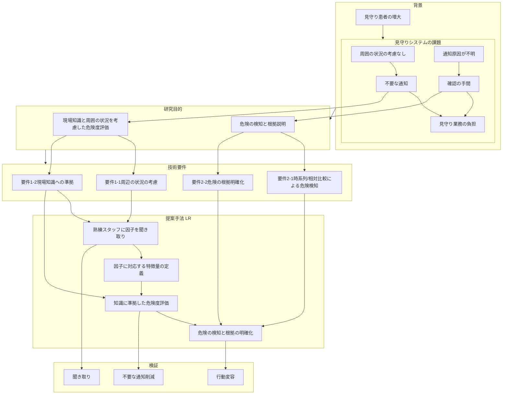

```mermaid
flowchart TB
    subgraph 背景
        direction TB
        見守り患者の増大 --> 見守りシステムの課題
        subgraph 見守りシステムの課題
            direction TB
            周囲の状況の考慮なし --> 不要な通知 
            通知原因が不明 --> 確認の手間
            不要な通知 --> 見守り業務の負担
            確認の手間 --> 見守り業務の負担
        end
    end
    subgraph 研究目的
        不要な通知 --> 現場知識と周囲の状況を考慮した危険度評価
        確認の手間 --> 危険の検知と根拠説明
    end
    subgraph 技術要件
        現場知識と周囲の状況を考慮した危険度評価 --> 要件1-1周辺の状況の考慮
        現場知識と周囲の状況を考慮した危険度評価 --> 要件1-2現場知識への準拠
        危険の検知と根拠説明 --> 要件2-1時系列/相対比較による危険検知
        危険の検知と根拠説明 --> 要件2-2危険の根拠明確化
    end
    subgraph 提案手法 LR
        要件1-1周辺の状況の考慮 --> 熟練スタッフに因子を聞き取り
        要件1-2現場知識への準拠 --> 熟練スタッフに因子を聞き取り
        因子に対応する特徴量の定義
        要件1-2現場知識への準拠 --> 知識に準拠した危険度評価
        要件2-1時系列/相対比較による危険検知 --> 危険の検知と根拠の明確化
        要件2-2危険の根拠明確化 --> 危険の検知と根拠の明確化
        熟練スタッフに因子を聞き取り-->因子に対応する特徴量の定義-->知識に準拠した危険度評価-->危険の検知と根拠の明確化
    end
    subgraph 検証
        熟練スタッフに因子を聞き取り --> 聞き取り
        知識に準拠した危険度評価 --> 不要な通知削減
        危険の検知と根拠の明確化 --> 行動変容
    end
    背景 --> 研究目的
    研究目的 --> 技術要件
```